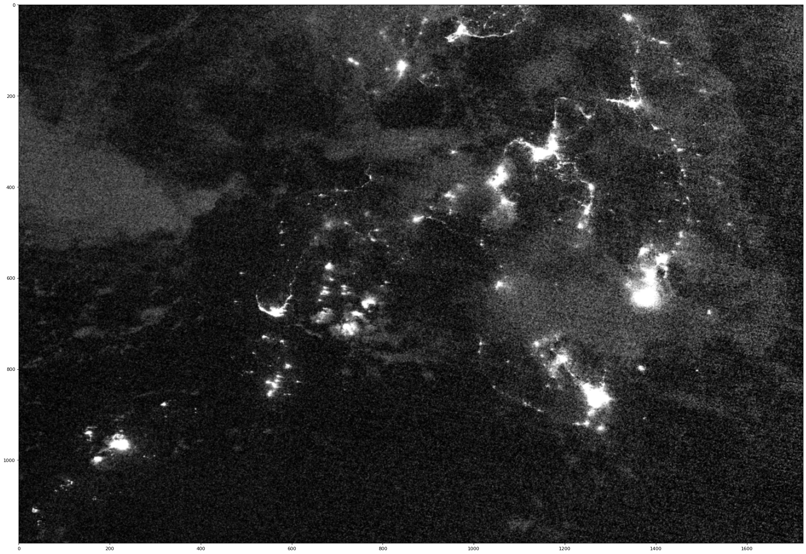
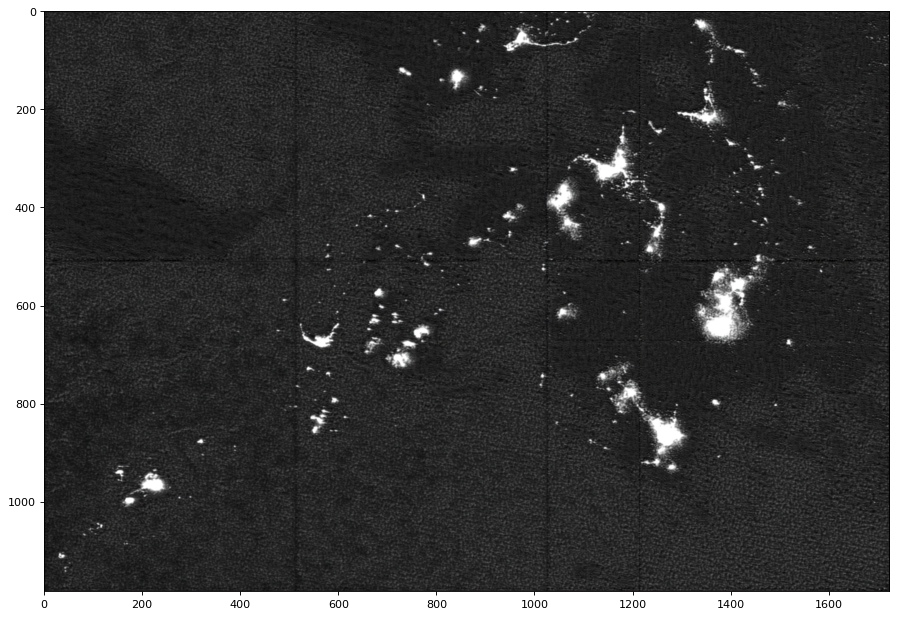
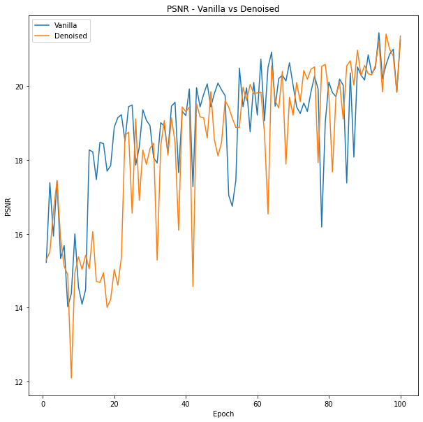
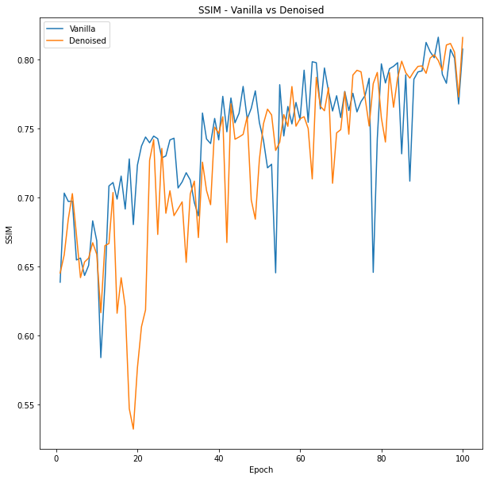

<div align="center">
<h1>SpA GAN for Cloud Removal in VIIRS Images</h1>
</div>

<div align="center">
    
</div>
<div align="center">
  
</div>


### new

- 2022.2.2 Read our blog post at  


## 1. INTRODUCTION

This is a fork of the Hang Pan's repository for [***Cloud Removal for Remote Sensing Imagery via Spatial Attention Generative Adversarial Network***](https://github.com/Penn000/SpA-GAN_for_cloud_removal).

## 2. DATASET

Click [here](https://www.kaggle.com/anthonymartinnavarez/viirscloudsdenoised) to access the datasets for VIIRSCLOUDS-Denoised or [here](https://www.kaggle.com/anthonymartinnavarez/viirscloudsvanilla) for VIIRSCLOUDS-Vanilla.

If you want to train locally, you may visit the original repo for more instructions.

## 3. TRAIN

If you are training on a local GPU, you may want to look at the original repo for instructions. If you plan to train on Kaggle, we have provided the SpaNet notebook which can be directly imported to Kaggle for training.

## 4. TEST

Note: Testing the model on an image with dimensions greater that 512x512 px will create a split version of the image. If you want to retain the original image size, check out the Cloud Removal Pipeline instead.

If you are predicting non-TIFF images, you may use the original prediction script:

```bash
python predict.py --config <path_to_config.yml_in_the_out_dir> --test_dir <path_to_a_directory_stored_test_data> --out_dir <path_to_an_output_directory> --pretrained <path_to_a_pretrained_model> --cuda
```

If you are predicting TIFF-related images, you may use:

```bash
python predict_tiff.py --config <path_to_config.yml_in_the_out_dir> --test_dir <path_to_a_directory_stored_test_data> --out_dir <path_to_an_output_directory> --pretrained <path_to_a_pretrained_model> --cuda
```

Click the lin to access the pre-trained models on [VIIRSCLOUDS-Vanilla](https://drive.google.com/drive/folders/1nJKkBOVR-xoV8T0kvrBdWhXS1f9XZWiX?usp=sharing) and [VIIRSCLOUDS-Denoised](https://drive.google.com/drive/folders/1x_1gFPVfygBlAWzKTf6uTvCCcRNqNylP?usp=sharing).

A sample comparison between the original image and output (from model trained on VIIRSCLOUDS-Denoised, epoch 60) is provided below:

<div align="center"></div>

<div align="center"></div>

## 5. EXPERIMENTS

This section demonstrates the performance comparison between a SpA GAN model trained using *VIIRSCLOUDS-Vanilla* and another SpA GAN model trained using *VIIRSCLOUDS-Denoised*  using peak signal to noise ratio (***PSNR***) and structural similarity index (***SSIM***) as metrics.


<div align="center"></div>

<div align="center"></div>


## 6. CLOUD REMOVAL PIPELINE

We have provided a script which removes the clouds of an image while retaining its dimensions unlike the testing script. To do this, you may use:

```bash
python prediction_script.py --input_image <path_to_image> --output_image <path_to_a_directory/output_image_name> --gpu <omit if using CPU> 
```

If you want to change the model used, you may edit the script. Alternatively, we have also provided a Prediction Script notebook if you want an interactive experience.

## 6. CONTACT

Contact me if you have any questions about the code and its execution.

E-mail: martinpnavarez@gmail.com

If you think this work is helpful for your research, give me a star :-D
